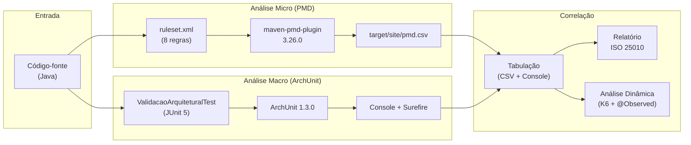

# Análise Estática — ISO 25010 (Manutenibilidade)

Documentação técnica da infraestrutura de análise estática do Spring PetClinic REST, configurada com **PMD 7.x** (microestrutural) e **ArchUnit 1.3.0** (macro-arquitetural), mapeada para as subcaracterísticas de **Manutenibilidade** da ISO/IEC 25010.

---

## 1. Fundamentação: Por que Análise Estática no TCC?

Fowler (2018) define *code smells* como "estruturas no código que sugerem a possibilidade de refatoração". Smells não são bugs — são indicadores de decisões de design que podem ter consequências negativas sob estresse. A análise estática automatiza a detecção desses indicadores, transformando observações subjetivas ("esse código parece acoplado") em **métricas objetivas** (CBO=24).

Richards e Ford (2020) elevam esse conceito ao introduzir *fitness functions*: "mecanismos automatizados que validam se uma característica arquitetural está sendo preservada". Neste TCC, as regras PMD e os testes ArchUnit funcionam como fitness functions de Manutenibilidade:

- **PMD:** detecta anomalias **micro**estruturais (dentro de uma classe ou método)
- **ArchUnit:** valida invariantes **macro**arquiteturais (entre pacotes e camadas)

A combinação de ambas oferece cobertura nos dois níveis de granularidade que Elemar Jr. destaca como necessários para uma análise de saúde arquitetural completa: "métricas de classe informam a qualidade do código; métricas de pacote informam a qualidade da arquitetura".

### Pipeline de Análise



---

## 2. Mapeamento ISO 25010 → Ferramentas

A ISO/IEC 25010 define Manutenibilidade como composta por 5 subcaracterísticas. Cada regra de análise estática é mapeada para a subcaracterística que ela protege:

| Subcaracterística | Métrica / Code Smell | Ferramenta | Regra | Referência Teórica |
|---|---|---|---|---|
| **Modularidade** | God Class | PMD | `GodClass` | Fowler (2018): "uma classe que tenta fazer demais" |
| **Modularidade** | LOC (Excessive Class) | PMD | XPath custom | Martin (2008): classes > 300 LOC violam SRP |
| **Analisabilidade** | Long Method | PMD | `NcssCount` + XPath | Fowler (2018): "extrair método" como refatoração primária |
| **Analisabilidade** | Complexidade Ciclomática | PMD | `CyclomaticComplexity` | McCabe (1976): CC > 10 = alto risco de erro |
| **Analisabilidade** | Feature Envy | PMD | `LawOfDemeter` | Gamma et al. (1995): princípio do menor conhecimento |
| **Modularidade** | Data Class | PMD | `DataClass` | Fowler (2018): "classes que são apenas containers de dados" |
| **Modularidade** | CBO | PMD | `CouplingBetweenObjects` | Chidamber & Kemerer (1994): CBO alto = difícil de manter |
| **Modularidade** | Dispersed Coupling | ArchUnit | Isolamento de camadas | Richards e Ford (2020): acoplamento aferente/eferente |
| **Modificabilidade** | Shotgun Surgery | ArchUnit | Service ✗→ Controller | Fowler (2018): "uma mudança requer alteração em muitas classes" |
| **Modularidade** | Acoplamento Cíclico | ArchUnit | `beFreeOfCycles()` | Ford et al. (2021): ciclos impedem decomposição |
| **Reusabilidade** | Ca/Ce (Fan-In/Out) | ArchUnit | `ArchitectureMetrics` | Martin (2003): princípio da estabilidade |

---

## 3. PMD — Configuração Microestrutural

### 3.1. Fundamentação dos Limiares

Os limiares não são arbitrários — cada um tem respaldo na literatura de engenharia de software:

| Métrica | Limiar | Referência |
|---|---|---|
| **CC** (Complexidade Ciclomática) | ≤ 10 por método | McCabe, T. J. (1976). *A Complexity Measure*. IEEE TSE, SE-2(4), pp. 308–320 |
| **CBO** (Coupling Between Objects) | ≤ 20 por classe | Chidamber, S. R.; Kemerer, C. F. (1994). *A Metrics Suite for OO Design*. IEEE TSE, 20(6). Valor conservador alinhado a Lanza & Marinescu (2006) |
| **LOC** (Classe) | ≤ 300 linhas | Martin, R. C. (2008). *Clean Code*. Prentice Hall |
| **LOC** (Método) | ≤ 50 linhas | Fowler, M. (2018). *Refactoring*, 2nd ed. |
| **NCSS** (Method) | ≤ 40 statements | Basili, V. R. et al. (1996). *A Validation of OO Design Metrics*. IEEE TSE, 22(10) |

> **Nota sobre PMD 7.x:** As regras `ExcessiveMethodLength` e `ExcessiveClassLength` foram removidas no PMD 7. Foram reimplementadas via XPath: `//MethodDeclaration[@EndLine - @BeginLine > 50]` e `//TypeDeclaration[@EndLine - @BeginLine > 300]`.

### 3.2. Plugin Maven

```xml
<plugin>
    <groupId>org.apache.maven.plugins</groupId>
    <artifactId>maven-pmd-plugin</artifactId>
    <version>3.26.0</version>
    <configuration>
        <rulesets>
            <ruleset>${project.basedir}/ruleset.xml</ruleset>
        </rulesets>
        <format>csv</format>
        <targetDirectory>${project.build.directory}/site</targetDirectory>
        <failOnViolation>false</failOnViolation>
    </configuration>
</plugin>
```

### 3.3. Comando de Execução

```bash
./mvnw clean compile pmd:pmd       # Gera CSV
./mvnw pmd:check -Dpmd.logViolationsToConsole=true  # Visualiza no terminal
```

---

## 4. ArchUnit — Configuração Macro-Arquitetural

### 4.1. Regras Implementadas

#### Isolamento de Camadas

Cada regra protege um invariante arquitetural, alinhado com o princípio de Richards e Ford (2020) de que "dependências devem seguir a direção da abstração":

| Regra | Verificação | Subcaracterística ISO 25010 |
|---|---|---|
| `controllers_nao_acessam_repositories` | Controller ✗→ Repository | Modularidade |
| `repositories_nao_acessam_controllers` | Repository ✗→ Controller | Modularidade |
| `repositories_nao_acessam_services` | Repository ✗→ Service | Modularidade |
| `services_nao_acessam_controllers` | Service ✗→ Controller | Modificabilidade |
| `model_nao_depende_de_camadas_superiores` | Model ✗→ tudo | Modularidade (DDD) |

#### Acoplamento Cíclico

```java
slices()
    .matching("org.springframework.samples.petclinic.(*)..") 
    .should().beFreeOfCycles()
    .ignoreDependency(resideInAPackage("..mapper.."), resideInAPackage("..rest.dto.."))
    .ignoreDependency(resideInAPackage("..mapper.."), resideInAPackage("..rest.api.."))
```

> O ciclo `mapper ↔ rest.dto` é excluído porque os DTOs são **gerados** pelo OpenAPI Generator — não representam débito técnico da lógica de negócios. Ford et al. (2021) distinguem "acoplamento acidental" (geração de código) de "acoplamento essencial" (decisão de design).

#### Métricas Ca/Ce

| Métrica | Significado | Interpretação (Richards e Ford, 2020) |
|---|---|---|
| **Ca** (Afferent) | Quantos pacotes dependem deste | Alto Ca = componente estável (difícil de mudar sem impacto) |
| **Ce** (Efferent) | De quantos pacotes este depende | Alto Ce = componente instável (sensível a mudanças externas) |
| **I** = Ce/(Ca+Ce) | Instabilidade | I=0 (máxima estabilidade) a I=1 (máxima instabilidade) |

---

## 5. Resultados do Código Original (Fork)

Os resultados abaixo refletem o estado do código **como herdado do fork** upstream, sem nenhuma alteração de lógica de negócio. Eles servem como registro das características estruturais do projeto original, validando que as ferramentas de análise estão corretamente configuradas.

### 5.1. PMD — Violações Detectadas (12 totais)

| # | Classe | Regra | Detalhe | Interpretação |
|---|---|---|---|---|
| 1–5 | Person, Pet, Role, User, Visit | DataClass | WOC baixo, NOAM alto | Entidades JPA são Data Classes por design — não necessariamente um problema, mas indica baixa coesão funcional (Fowler, 2018) |
| 6 | JdbcPet | DataClass | WOC=0.0% | Classe auxiliar da implementação JDBC — irrelevante para o perfil ativo (spring-data-jpa) |
| 7–9 | JpaOwnerRepositoryImpl | LawOfDemeter | `getSingleResult` on foreign value (×3) | Violação do princípio do menor conhecimento: o repositório navega grafos de objetos ao invés de usar queries diretas |
| 10 | BindingError | DataClass | WOC=20.0% | DTO de validação — Data Class por definição |
| 11 | OwnerRestController | CBO=23 | Limiar: 20 | Controller depende de 23 tipos distintos — reflexo da API ampla |
| 12 | **ClinicServiceImpl** | **CBO=24** | **Limiar: 20** | **Façade com 6 repositórios injetados. Característica herdada do projeto original.** |

> **Observação:** O `ClinicServiceImpl` é a classe com maior CBO e é também o ponto central de instrumentação `@Observed`. Independente da estratégia experimental adotada (refatoração do código existente ou injeção de anomalias adicionais), essa classe será o principal alvo de análise de correlação estática ↔ dinâmica.

### 5.2. ArchUnit — Métricas de Acoplamento por Pacote (código original)

| Pacote | Ca | Ce | I (Instabilidade) | A (Abstração) | Análise |
|---|---|---|---|---|---|
| `model` | 5 | 0 | 0.000 | 0.000 | Máxima estabilidade — dependido por todos, depende de ninguém |
| `rest` | 1 | 3 | 0.750 | 0.263 | Alta instabilidade — esperado para camada de borda |
| `service` | 1 | 2 | 0.667 | 0.500 | Balanceado — mas Ce=2 baixo mascara o CBO=24 interno |
| `repository` | 1 | 2 | 0.667 | 0.462 | Abstração razoável (interfaces + implementações) |
| `config` | 0 | 0 | 1.000 | 0.000 | Isolado — correto para configuração |

### 5.3. ArchUnit — Status das Regras

| Regra | Status |
|---|---|
| Controllers ✗→ Repositories | ✅ PASS |
| Repositories ✗→ Controllers | ✅ PASS |
| Repositories ✗→ Services | ✅ PASS |
| Services ✗→ Controllers | ✅ PASS |
| Model ✗→ Camadas superiores | ✅ PASS |
| Ausência de Ciclos | ✅ PASS |

> Todas as regras passam, confirmando que o débito técnico do código original é **intra-classe** (CBO, Data Class) e não **inter-pacote** (ciclos, inversão de camadas). Essa distinção é relevante para o TCC: demonstra que as características estruturais de interesse residem no nível micro (design de classe), não no nível macro (arquitetura de pacotes).

---

## 6. Comandos Resumo

```bash
# PMD completa (gera CSV)
./mvnw clean compile pmd:pmd

# Violações no terminal
./mvnw pmd:check -Dpmd.logViolationsToConsole=true

# Formatar CSV
column -s, -t target/site/pmd.csv

# ArchUnit (validação + métricas)
./mvnw test -Dtest="ValidacaoArquiteturalTest" -Dsurefire.useFile=false

# Apenas métricas Ca/Ce
./mvnw test -Dtest="ValidacaoArquiteturalTest#extrairMetricasAcoplamento" -Dsurefire.useFile=false

# Build completo
./mvnw compile pmd:pmd && ./mvnw test -Dsurefire.useFile=false
```

---

## 7. Arquivos Criados/Modificados

| Arquivo | Ação | Finalidade |
|---|---|---|
| `ruleset.xml` | Criado | Ruleset PMD 7.x com mapeamento ISO 25010 |
| `pom.xml` | Modificado | Plugin PMD + dependência ArchUnit |
| `ValidacaoArquiteturalTest.java` | Criado | Testes ArchUnit (camadas + ciclos + métricas) |
| `docs/analise-estatica-iso25010.md` | Criado | Esta documentação |

---

## Referências

- McCabe, T. J. (1976). *A Complexity Measure*. IEEE TSE, SE-2(4).
- Chidamber, S. R.; Kemerer, C. F. (1994). *A Metrics Suite for OO Design*. IEEE TSE, 20(6).
- Gamma, E. et al. (1995). *Design Patterns*. Addison-Wesley.
- Basili, V. R. et al. (1996). *A Validation of OO Design Metrics*. IEEE TSE, 22(10).
- Lanza, M.; Marinescu, R. (2006). *Object-Oriented Metrics in Practice*. Springer.
- Martin, R. C. (2008). *Clean Code*. Prentice Hall.
- Fowler, M. (2018). *Refactoring*, 2nd ed. Addison-Wesley.
- Richards, M.; Ford, N. (2020). *Fundamentals of Software Architecture*. O'Reilly.
- Ford, N.; Richards, M. et al. (2021). *Software Architecture: The Hard Parts*. O'Reilly.
- Elemar Jr. *Manual do Arquiteto de Software*. https://elemarjr.com
