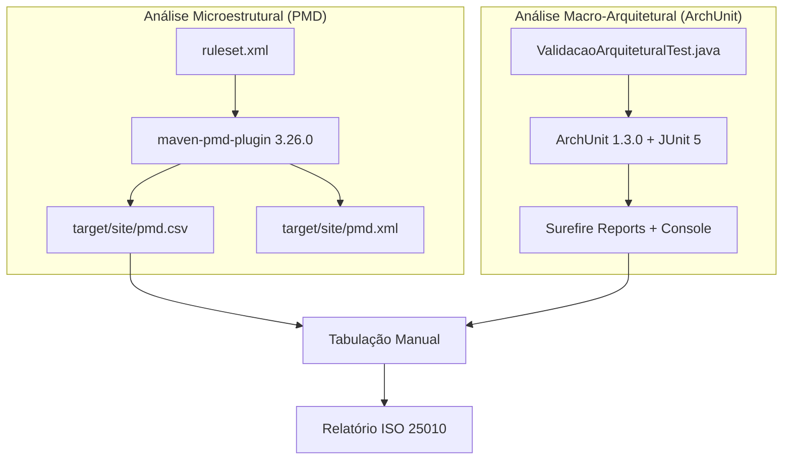

# Análise Estática – ISO 25010 (Manutenibilidade)

> Documentação técnica da infraestrutura de análise estática do Spring PetClinic REST,
> configurada com **PMD 7.x** (microestrutural) e **ArchUnit 1.3.0** (macro-arquitetural).

---

## 1. Visão Geral da Arquitetura de Análise



---

## 2. Mapeamento ISO 25010 → Ferramentas

| Subcaracterística ISO 25010 | Métrica / Code Smell | Ferramenta | Regra / Método |
|---|---|---|---|
| **Modularidade** | God Class | PMD | `GodClass` |
| **Modularidade** | LOC (Excessive Class) | PMD | `ExcessiveClassLength` (XPath) |
| **Analisabilidade** | Long Method | PMD | `NcssCount` + `ExcessiveMethodLength` (XPath) |
| **Analisabilidade** | Complexidade Ciclomática | PMD | `CyclomaticComplexity` |
| **Analisabilidade** | Feature Envy | PMD | `LawOfDemeter` |
| **Modularidade** | Data Class | PMD | `DataClass` |
| **Modularidade** | CBO (Coupling Between Objects) | PMD | `CouplingBetweenObjects` |
| **Modularidade** | Dispersed Coupling | ArchUnit | Isolamento de camadas |
| **Modificabilidade** | Shotgun Surgery | ArchUnit | Regras ascendência Service→Controller |
| **Modularidade** | Acoplamento Cíclico | ArchUnit | `slices().beFreeOfCycles()` |
| **Reusabilidade** | Ca (Fan-In) / Ce (Fan-Out) | ArchUnit | `ArchitectureMetrics` |

---

## 3. PMD – Configuração Microestrutural

### 3.1. Arquivo `ruleset.xml`

Localização: raiz do projeto (`/ruleset.xml`)

**Regras ativas:**

| # | Regra PMD | Code Smell Mapeado | Tipo | Limiar |
|---|---|---|---|---|
| 1 | `GodClass` | God Class | Built-in | WMC/ATFD/TCC defaults |
| 2 | `NcssCount` | Long Method | Built-in | method=40, class=500 |
| 3 | `ExcessiveMethodLength` | Long Method (LOC) | XPath custom | >50 linhas |
| 4 | `LawOfDemeter` | Feature Envy | Built-in | Defaults |
| 5 | `DataClass` | Data Class | Built-in | WOC/NOPA/NOAM/WMC |
| 6 | `CyclomaticComplexity` | CC | Built-in | method=10, class=80 |
| 7 | `CouplingBetweenObjects` | CBO | Built-in | threshold=20 |
| 8 | `ExcessiveClassLength` | LOC | XPath custom | >300 linhas |

> **Nota**: As regras `ExcessiveMethodLength` e `ExcessiveClassLength` foram removidas no PMD 7.x.
> Reimplementadas via XPath: `//MethodDeclaration[@EndLine - @BeginLine > 50]` e
> `//TypeDeclaration[@EndLine - @BeginLine > 300]`.

### 3.2a. Fundamentação Acadêmica dos Limiares

| Métrica | Limiar | Referência Acadêmica |
|---|---|---|
| **CC** (Complexidade Ciclomática) | ≤ 10 por método | McCabe, T. J. (1976). *"A Complexity Measure"*. IEEE Transactions on Software Engineering, SE-2(4), pp. 308–320. |
| **CBO** (Coupling Between Objects) | ≤ 20 por classe | Chidamber, S. R.; Kemerer, C. F. (1994). *"A Metrics Suite for Object-Oriented Design"*. IEEE TSE, 20(6), pp. 476–493. Valor conservador alinhado a Lanza, M.; Marinescu, R. (2006). *"Object-Oriented Metrics in Practice"*, Springer. |
| **LOC** (Excessive Class Length) | ≤ 300 linhas | Martin, R. C. (2008). *"Clean Code: A Handbook of Agile Software Craftsmanship"*. Prentice Hall. |
| **LOC** (Excessive Method Length) | ≤ 50 linhas | Fowler, M. (2018). *"Refactoring: Improving the Design of Existing Code"*, 2nd ed. Addison-Wesley. |
| **NCSS** (Method) | ≤ 40 statements | Basili, V. R.; Briand, L. C.; Melo, W. L. (1996). *"A Validation of OO Design Metrics as Quality Indicators"*. IEEE TSE, 22(10), pp. 751–761. |

### 3.2. Plugin Maven

```xml
<plugin>
    <groupId>org.apache.maven.plugins</groupId>
    <artifactId>maven-pmd-plugin</artifactId>
    <version>3.26.0</version>
    <configuration>
        <rulesets>
            <ruleset>${project.basedir}/ruleset.xml</ruleset>
        </rulesets>
        <format>csv</format>
        <targetDirectory>${project.build.directory}/site</targetDirectory>
        <failOnViolation>false</failOnViolation>
    </configuration>
</plugin>
```

### 3.3. Comando de Execução

```bash
./mvnw clean compile pmd:pmd
```

**Output**: `target/site/pmd.csv`

### 3.4. Estrutura do CSV

```
"Problem","Package","File","Priority","Line","Description","Rule set","Rule"
```

Cada linha contém uma violação detectada com:
- Nome da regra violada
- Arquivo e linha
- Descrição com valores brutos (WOC, NOPA, NOAM, WMC, CBO, etc.)

---

## 4. ArchUnit – Configuração Macro-Arquitetural

### 4.1. Dependência

```xml
<dependency>
    <groupId>com.tngtech.archunit</groupId>
    <artifactId>archunit-junit5</artifactId>
    <version>1.3.0</version>
    <scope>test</scope>
</dependency>
```

### 4.2. Classe de Teste

**Localização**: `src/test/java/org/springframework/samples/petclinic/architecture/ValidacaoArquiteturalTest.java`

### 4.3. Regras Implementadas

#### 4.3.1. Isolamento de Camadas (Dispersed Coupling / Shotgun Surgery)

| Regra | Verificação | Mitigação |
|---|---|---|
| `controllers_nao_acessam_repositories` | Controller ✗→ Repository | Dispersed Coupling |
| `repositories_nao_acessam_controllers` | Repository ✗→ Controller | Inversão de dependência |
| `repositories_nao_acessam_services` | Repository ✗→ Service | Camada mais interna isolada |
| `services_nao_acessam_controllers` | Service ✗→ Controller | Shotgun Surgery |
| `model_nao_depende_de_camadas_superiores` | Model ✗→ Controller/Service/Repository/Config | DDD: domínio puro |

#### 4.3.2. Acoplamento Cíclico

Verifica ausência de dependências circulares entre pacotes de negócio,
excluindo dependências de/para pacotes gerados automaticamente (`rest.dto`, `rest.api`)
que não representam débito técnico estrutural:

```java
slices()
    .matching("org.springframework.samples.petclinic.(*)..")
    .should().beFreeOfCycles()
    .ignoreDependency(resideInAPackage("..mapper.."), resideInAPackage("..rest.dto.."))
    .ignoreDependency(resideInAPackage("..mapper.."), resideInAPackage("..rest.api.."))
```

#### 4.3.3. Métricas de Acoplamento (Ca/Ce)

O método `extrairMetricasAcoplamento()` usa `ArchitectureMetrics.componentDependencyMetrics()` para calcular:

| Métrica | Significado | Fórmula |
|---|---|---|
| **Ca** (Afferent Coupling) | Fan-In: quantos pacotes dependem deste | Contagem direta |
| **Ce** (Efferent Coupling) | Fan-Out: de quantos pacotes este depende | Contagem direta |
| **I** (Instability) | Instabilidade | Ce / (Ca + Ce) |
| **A** (Abstractness) | Grau de abstração | Interfaces / Total classes |

### 4.4. Comando de Execução

```bash
# Todos os testes ArchUnit
./mvnw test -Dtest="ValidacaoArquiteturalTest" -Dsurefire.useFile=false

# Apenas métricas de acoplamento
./mvnw test -Dtest="ValidacaoArquiteturalTest#extrairMetricasAcoplamento" -Dsurefire.useFile=false
```

---

## 5. Resultados Baseline (Pré-Refatoração)

### 5.1. PMD – Violações Detectadas (12 totais)

| # | Classe | Regra | Detalhe |
|---|---|---|---|
| 1 | `Person` | DataClass | WOC=0.0%, NOAM=4, WMC=4 |
| 2 | `Pet` | DataClass | WOC=27.3%, NOAM=8, WMC=12 |
| 3 | `Role` | DataClass | WOC=0.0%, NOAM=4, WMC=4 |
| 4 | `User` | DataClass | WOC=11.1%, NOAM=8, WMC=10 |
| 5 | `Visit` | DataClass | WOC=0.0%, NOAM=6, WMC=7 |
| 6 | `JdbcPet` | DataClass | WOC=0.0%, NOAM=4, WMC=4 |
| 7-9 | `JpaOwnerRepositoryImpl` | LawOfDemeter | `getSingleResult` on foreign value (×3) |
| 10 | `BindingError` | DataClass | WOC=20.0%, NOAM=4, WMC=6 |
| 11 | `OwnerRestController` | CouplingBetweenObjects | CBO=23 (limiar: 20) |
| 12 | `ClinicServiceImpl` | CouplingBetweenObjects | CBO=24 (limiar: 20) |

### 5.2. ArchUnit – Métricas de Acoplamento

| Pacote | Ca (Fan-In) | Ce (Fan-Out) | I (Instabilidade) | A (Abstração) |
|---|---|---|---|---|
| `model` | 5 | 0 | 0.000 | 0.000 |
| `rest` | 1 | 3 | 0.750 | 0.263 |
| `service` | 1 | 2 | 0.667 | 0.500 |
| `repository` | 1 | 2 | 0.667 | 0.462 |
| `mapper` | 1 | 2 | 0.667 | 0.500 |
| `util` | 1 | 1 | 0.500 | 0.500 |
| `config` | 0 | 0 | 1.000 | 0.000 |
| `security` | 0 | 0 | 1.000 | 0.000 |

### 5.3. ArchUnit – Status das Regras

| Regra | Status | Observação |
|---|---|---|
| Controllers ✗→ Repositories | ✅ PASS | Isolamento respeitado |
| Repositories ✗→ Controllers | ✅ PASS | Isolamento respeitado |
| Repositories ✗→ Services | ✅ PASS | Isolamento respeitado |
| Services ✗→ Controllers | ✅ PASS | Isolamento respeitado |
| Model ✗→ Camadas superiores | ✅ PASS | DDD respeitado |
| Ausência de Ciclos | ✅ PASS | Dependências para DTOs gerados excluídas via `ignoreDependency` |

> **Nota**: O ciclo estrutural `mapper ↔ rest` (Mappers dependem de DTOs gerados pelo OpenAPI Generator
> em `rest.dto`/`rest.api`) foi excluído da verificação via `ignoreDependency()`, pois não representa
> débito técnico da lógica de negócios. Apenas ciclos entre pacotes **core** (service, repository,
> controller, model) são avaliados.

---

## 6. Comandos Resumo

```bash
# 1. Análise PMD completa (gera CSV)
./mvnw clean compile pmd:pmd

# 2. Visualizar violações PMD diretamente no terminal
./mvnw pmd:check -Dpmd.logViolationsToConsole=true

# 3. Formatar CSV no terminal (Linux/bash)
column -s, -t target/site/pmd.csv

# 4. Testes ArchUnit (validação + métricas)
./mvnw test -Dtest="ValidacaoArquiteturalTest" -Dsurefire.useFile=false

# 5. Apenas métricas Ca/Ce
./mvnw test -Dtest="ValidacaoArquiteturalTest#extrairMetricasAcoplamento" -Dsurefire.useFile=false

# 6. Build completo (PMD + testes separados para evitar interrupção)
./mvnw compile pmd:pmd && ./mvnw test -Dsurefire.useFile=false
```

---

## 7. Arquivos Criados/Modificados

| Arquivo | Ação | Finalidade |
|---|---|---|
| `ruleset.xml` | Criado | Ruleset PMD 7.x com mapeamento ISO 25010 |
| `pom.xml` | Modificado | Plugin PMD + dependência ArchUnit |
| `ValidacaoArquiteturalTest.java` | Criado | Testes ArchUnit (camadas + ciclos + métricas) |
| `docs/analise-estatica-iso25010.md` | Criado | Esta documentação |
