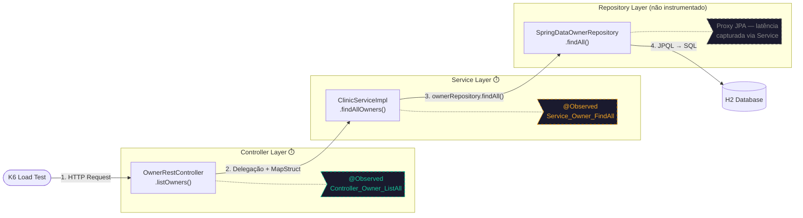
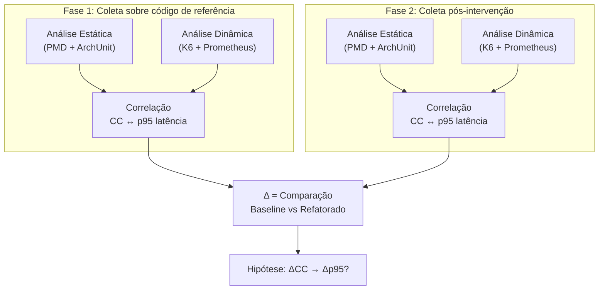

# Instrumentação Dinâmica — Observabilidade com Micrometer

Documentação técnica do mapeamento de métricas granulares da API Spring PetClinic REST.  
O objetivo é rastrear a latência em diferentes camadas (Controller, Service) para correlacionar gargalos dinâmicos (como N+1 e contenção de banco) com métricas de análise estática (CC, CBO, LCOM).

> **Documentos complementares:**
> - [Referência Técnica](referencia-tecnica-petclinic.md) — Visão geral da aplicação, padrões de projeto (Facade, Strategy), e contexto do TCC
> - [Análise Estática ISO 25010](analise-estatica-iso25010.md) — Regras PMD, testes ArchUnit, baseline de violações
> - [Prometheus + Micrometer](../../infra/docs/guides/prometheus-micrometer.md) — Modelo de dados, PromQL de referência, cardinalidade
> - [K6 Load Testing](../../infra/docs/guides/k6-load-testing.md) — Perfil de carga, thresholds, relação K6 ↔ @Observed
> - [Grafana](../../infra/docs/guides/grafana.md) — Dashboard @Observed, interpretação de painéis, exportação de dados

---

## 1. Visão Geral da Instrumentação Granular

Para provar a hipótese de que o débito técnico estrutural afeta o comportamento dinâmico sob carga, medir apenas o tempo total da requisição HTTP (borda) é insuficiente. A anotação `@Observed` da Observation API do Micrometer é injetada em métodos específicos do _core path_ para criar sub-métricas de Timer. Isso permite isolar o tempo gasto no processamento HTTP (Controller) e na execução das regras de negócio + queries JPA (Service).

### Decisão Arquitetural: Duas Camadas, Não Três

A instrumentação cobre **Controller** e **Service**, mas **não o Repository diretamente**. Esta é uma decisão deliberada, não uma limitação:

**Razão técnica:** Os repositórios ativos (`SpringDataOwnerRepository`, `SpringDataVetRepository`, etc.) são interfaces Spring Data JPA. Em runtime, o Spring gera proxies dinâmicos (`JdkDynamicAopProxy`) para essas interfaces. O `ObservedAspect` opera via Spring AOP (proxy-based), que não consegue interceptar métodos em proxies já criados pelo Spring Data — a anotação `@Observed` em uma interface Spring Data é silenciosamente ignorada.

**Razão experimental:** O `ClinicServiceImpl` encapsula 100% das chamadas ao repositório. Cada método de serviço instrumentado (ex: `findAllOwners()`) executa exatamente uma delegação ao repositório correspondente (`ownerRepository.findAll()`). Portanto, a latência medida no Service **inclui integralmente** o tempo de execução da query JPA + overhead transacional (`@Transactional`). A diferença `T(Controller) - T(Service)` isola precisamente o custo de serialização MapStruct + marshalling JSON.

> **Fundamentação:** Richards e Ford (2020) definem a *fitness function* arquitetural como uma métrica objetiva que protege uma característica do sistema. No nosso caso, a fitness function é `p95(Service_Owner_FindAll) < threshold`, e ela captura a degradação da camada de dados sem instrumentar o proxy JPA diretamente — uma aplicação do princípio de *suficiência mínima* que Ford, Parsons e Kua (2017) advogam em *Building Evolutionary Architectures*: "instrumentar o necessário para que a fitness function seja avaliável, sem acoplar a governança à implementação interna".

### Diagrama de Fluxo: Granularidade da Medição

O diagrama abaixo mostra como a instrumentação envolve cada camada no fluxo de uma requisição crítica (ex: `GET /api/owners`):



### Decomposição de Latência

Para qualquer requisição instrumentada, a latência total pode ser decomposta assim:

```
T(HTTP total) = T(Controller) = T(MapStruct) + T(Service) + T(Serialização JSON)
T(Service)    = T(@Transactional) + T(Repository proxy) + T(Query JPA) + T(Flush)
```

O que medimos:

| Ponto de medição | O que captura | Como isolar |
|---|---|---|
| `metodo_execucao_seconds{contextualName="Controller_Owner_ListAll"}` | Tempo total do método do controller (inclui service + serialização) | Valor direto |
| `metodo_execucao_seconds{contextualName="Service_Owner_FindAll"}` | Tempo no service (inclui transação + query JPA) | Valor direto |
| **Delta: Controller - Service** | Overhead de MapStruct + JSON marshalling | Calculado via PromQL |

---

## 2. Padronização e Nomenclatura

Toda anotação `@Observed` segue estritamente o formato:

- **`name`**: Sempre `"metodo.execucao"`. Gera a métrica base no Prometheus: `metodo_execucao_seconds_bucket`, `metodo_execucao_seconds_count`, `metodo_execucao_seconds_sum`.
- **`contextualName`**: Identificador único no formato `[Camada]_[Entidade]_[Ação]`.

O `name` fixo permite agregar todas as observações numa única query PromQL, diferenciando-as pela tag `spring.observation.contextual-name`.

### Exemplo de Implementação

```java
@Override
@Transactional(readOnly = true)
@Observed(name = "metodo.execucao", contextualName = "Service_Owner_FindAll")
public Collection<Owner> findAllOwners() throws DataAccessException {
    return ownerRepository.findAll();
}
```

### Métricas Geradas no Prometheus

Para cada método anotado, o `ObservedAspect` emite:

| Série Prometheus | Tags | Semântica |
|---|---|---|
| `metodo_execucao_seconds_bucket` | `le`, `class`, `method`, `error` | Distribuição de latência (histograma) |
| `metodo_execucao_seconds_count` | `class`, `method`, `error` | Total de invocações |
| `metodo_execucao_seconds_sum` | `class`, `method`, `error` | Soma acumulada do tempo |

---

## 3. Mapeamento de Endpoints Críticos (Core Path)

As anotações são aplicadas exclusivamente nos fluxos abaixo. Cada fluxo foi selecionado por apresentar um risco arquitetural específico que o teste de carga pode revelar.

### Fluxo 1: Carga N+1 — `GET /api/owners`

**Risco:** `Owner` carrega `Set<Pet>` com `FetchType.EAGER`, que por sua vez carrega `Set<Visit>` EAGER. Listar todos os owners dispara cascata de queries proporcional ao volume de dados.

| Camada | Método real | contextualName |
|---|---|---|
| Controller | `OwnerRestController.listOwners()` | `Controller_Owner_ListAll` |
| Service | `ClinicServiceImpl.findAllOwners()` | `Service_Owner_FindAll` |

---

### Fluxo 2: Consulta com Grafo Denso — `GET /api/owners/{id}`

**Risco:** Retorna owner + pets aninhados + visits de cada pet. Potencial N+1 se não otimizado. Latência proporcional ao nº de pets/visits.

| Camada | Método real | contextualName |
|---|---|---|
| Controller | `OwnerRestController.getOwner()` | `Controller_Owner_FindById` |
| Service | `ClinicServiceImpl.findOwnerById()` | `Service_Owner_FindById` |

---

### Fluxo 3: Write-path Completo — `POST /api/owners`

**Risco:** Validação `@NotEmpty`/`@Pattern`/`@Digits` → mapeamento MapStruct → JPA persist → flush. Contenção de locks sob alta concorrência.

| Camada | Método real | contextualName |
|---|---|---|
| Controller | `OwnerRestController.addOwner()` | `Controller_Owner_Add` |
| Service | `ClinicServiceImpl.saveOwner()` | `Service_Owner_Save` |

---

### Fluxo 4: Cascata JPA e Lookup — `POST /api/owners/{id}/pets`

**Risco:** `savePet()` faz lookup de `PetType` antes de salvar. `CascadeType.ALL` no `Pet.type` pode causar side-effects. Este fluxo exercita 3 métodos de serviço em sequência.

| Camada | Método real | contextualName |
|---|---|---|
| Controller | `OwnerRestController.addPetToOwner()` | `Controller_Pet_AddToOwner` |
| Service | `ClinicServiceImpl.findOwnerById()` | `Service_Owner_FindById` |
| Service | `ClinicServiceImpl.findPetTypeById()` | `Service_PetType_FindById` |
| Service | `ClinicServiceImpl.savePet()` | `Service_Pet_Save` |

> **Nota:** Este é o fluxo com maior _fan-out_ no Service — o controller chama `findOwnerById` (validação), depois `savePet` que internamente chama `findPetTypeById`. A instrumentação captura cada sub-operação individualmente, permitindo identificar se o gargalo está no lookup de tipo ou no persist JPA.

---

### Fluxo 5: Inserção Filha — `POST /api/visits` e `POST /api/owners/{id}/pets/{id}/visits`

**Risco:** Criação de visit requer lookup do pet, potencial lock no owner pai via foreign key. Deadlock sob alta concorrência.

| Camada | Método real | contextualName |
|---|---|---|
| Controller (direto) | `VisitRestController.addVisit()` | `Controller_Visit_Add` |
| Controller (nested) | `OwnerRestController.addVisitToOwner()` | `Controller_Visit_AddToOwner` |
| Service | `ClinicServiceImpl.saveVisit()` | `Service_Visit_Save` |

---

### Fluxo 6: Relação N:M EAGER — `GET /api/vets`

**Risco:** `Vet` → `Specialty` via `@ManyToMany EAGER` + tabela de junção `vet_specialties`. Grafo denso que causa memory pressure sob volume.

| Camada | Método real | contextualName |
|---|---|---|
| Controller | `VetRestController.listVets()` | `Controller_Vet_ListAll` |
| Service | `ClinicServiceImpl.findAllVets()` | `Service_Vet_FindAll` |

---

## 4. Avaliação da Granularidade: Por que Duas Camadas São Suficientes

### 4.1. Princípio da Suficiência Mínima

A decisão de instrumentar apenas Controller e Service segue o princípio que Ford, Parsons e Kua (2017) chamam de *governança automatizada proporcional*: o custo de cada ponto de observação deve ser justificado pela informação que ele adiciona à decisão arquitetural.

Adicionar `@Observed` no Repository traria:
- **Overhead adicional:** Cada anotação cria um `Observation` com lifecycle completo (start → stop → publish). Em 50 VUs concorrentes, isso significa 50 × 7 endpoints × 3 camadas = 1.050 observations/segundo, contra 700 com duas camadas — um aumento de 50% no overhead que distorceria exatamente o que estamos tentando medir.
- **Informação redundante:** Como `ClinicServiceImpl.findAllOwners()` executa exclusivamente `ownerRepository.findAll()`, o `T(Service)` já é `T(Repository) + ε` onde `ε` é o overhead transacional (~microsegundos), negligível frente à latência de query (milisegundos).

### 4.2. O Efeito Observador (Heisenberg Effect)

Fowler (2018) alerta em *Refactoring* que instrumentação excessiva pode mascarar o próprio fenômeno que se deseja observar. No contexto de testes de carga, cada `Observation` consome:
- 1 alocação de `Observation.Context` no heap
- 1 chamada ao `ObservationRegistry` (synchronized)
- N chamadas a `ObservationHandler.onStop()` (uma por handler registrado)

Sob estresse (fase de spike com 50 VUs), esse overhead composto pode saturar o GC e introduzir *stop-the-world pauses* que inflam artificialmente os percentis de latência — exatamente as métricas que fundamentam a hipótese do TCC.

### 4.3. Alinhamento com Fitness Functions

Richards e Ford (2020) definem que uma *fitness function* eficaz deve ser:
1. **Automatizável** — nossas métricas são exportadas automaticamente via `/actuator/prometheus`
2. **Objetiva** — `p95(metodo_execucao_seconds{contextualName="Service_Owner_FindAll"})` é um número, não uma opinião
3. **Não-intrusiva** — a instrumentação não altera a lógica de negócio (AOP transparente)

A granularidade Controller + Service satisfaz os três critérios. Adicionar o Repository violaria o terceiro (introduz overhead mensurável que altera o sistema sob teste).

---

## 5. Perspectiva do Experimento: Débito Técnico como Variável Independente

### 5.1. O que Estamos Medindo

No contexto deste TCC, os _code smells_ (N+1, EAGER em cascata, alto CBO no `ClinicServiceImpl`, God Class no façade) **não são bugs funcionais**. São características estruturais herdadas do código original do fork que a análise estática detecta (PMD: CC, CBO; ArchUnit: Ca/Ce — ver [análise estática](analise-estatica-iso25010.md)) mas que os testes unitários aprovam com 100% de sucesso. Elemar Jr. reforça que "métricas estáticas são diagnósticos, não sentenças — o impacto real só se revela sob carga".

O experimento opera em duas fases de coleta com intervenção no código entre elas:



### 5.2. Fundamentação Teórica

**Fowler (2018)** distingue *refactoring* de *performance optimization*: refatorar melhora a estrutura interna sem alterar o comportamento observável. O TCC investiga se essa melhoria estrutural tem efeito colateral mensurável no comportamento dinâmico — o que Fowler admite como possível mas "raramente linear".

**Richards e Ford (2020)** argumentam que acoplamento aferente (Ca) e eferente (Ce) — métricas que o PMD/ArchUnit calculam como CBO e Ca/Ce — são *leading indicators* de degradação. Um `ClinicServiceImpl` com CBO alto (dependência de 6 repositórios) é, por definição, um ponto de contenção transacional. O `@Observed` no Service mede exatamente essa contenção.

**Ford, Richards et al. (2021)** em *As Partes Difíceis* discutem o conceito de *quantum arquitetural*: a menor unidade deployável que possui alta coesão funcional. No PetClinic monolítico, o quantum é a aplicação inteira, e o `ClinicServiceImpl` é o *hub* que conecta todos os domínios. Refatorar esse façade (ex: extrair `OwnerService`, `VetService`) reduz o CBO e potencialmente a contenção — hipótese testável com nossas métricas.

**Ford, Parsons e Kua (2017)** propõem que fitness functions devem ser integradas ao pipeline de CI/CD. Os thresholds do K6 (`p95 < 1500ms`) funcionam como fitness functions automatizadas: se uma refatoração degrada o p95, o K6 retorna exit code 99 — um _gate_ automático.

---

## 6. Pré-requisitos de Infraestrutura

Para que a instrumentação funcione e exporte dados para `/actuator/prometheus`:

### 6.1. Dependências Maven (já presentes no `pom.xml`)

```xml
<!-- AOP para interceptação via proxy -->
<dependency>
    <groupId>org.springframework.boot</groupId>
    <artifactId>spring-boot-starter-aop</artifactId>
</dependency>

<!-- Registry Prometheus para exportação de métricas -->
<dependency>
    <groupId>io.micrometer</groupId>
    <artifactId>micrometer-registry-prometheus</artifactId>
</dependency>
```

### 6.2. Classe de Configuração

```java
@Configuration(proxyBeanMethods = false)
public class ObservabilityConfig {

    @Bean
    ObservedAspect observedAspect(ObservationRegistry registry) {
        return new ObservedAspect(registry);
    }
}
```

- `proxyBeanMethods = false`: segue a convenção _lite mode_ do Spring Boot 3+/4+, evitando proxy CGLIB na classe de configuração.
- O `ObservationRegistry` é auto-configurado pelo Spring Boot Actuator.

### 6.3. Propriedades do Actuator (`application.properties`)

```properties
management.endpoints.web.exposure.include=prometheus,health,metrics,info
management.metrics.distribution.percentiles-histogram.http.server.requests=true
```

---

## 7. Consultas PromQL para Análise

### Latência p95 por camada (Service vs Controller)

```promql
histogram_quantile(0.95,
  sum(rate(metodo_execucao_seconds_bucket[5m])) by (le, spring_observation_contextual_name)
)
```

### Delta Controller - Service (overhead de serialização)

```promql
histogram_quantile(0.95,
  sum(rate(metodo_execucao_seconds_bucket{spring_observation_contextual_name="Controller_Owner_ListAll"}[5m])) by (le)
)
-
histogram_quantile(0.95,
  sum(rate(metodo_execucao_seconds_bucket{spring_observation_contextual_name="Service_Owner_FindAll"}[5m])) by (le)
)
```

### Taxa de erro por método

```promql
sum(rate(metodo_execucao_seconds_count{error!="none"}[5m])) by (class, method)
/
sum(rate(metodo_execucao_seconds_count[5m])) by (class, method)
```

---

## Referências

- RICHARDS, M.; FORD, N. **Fundamentos da Arquitetura de Software: Uma Abordagem de Engenharia**. O'Reilly, 2020.
- FORD, N.; RICHARDS, M.; SADALAGE, P.; DEHGHANI, Z. **Arquitetura de Software: As Partes Difíceis**. O'Reilly, 2021.
- FORD, N.; PARSONS, R.; KUA, P. **Building Evolutionary Architectures: Automated Software Governance**. O'Reilly, 2017.
- FOWLER, M. **Refatoração: Aperfeiçoando o Design de Códigos Existentes**. 2ª ed. Addison-Wesley, 2018.