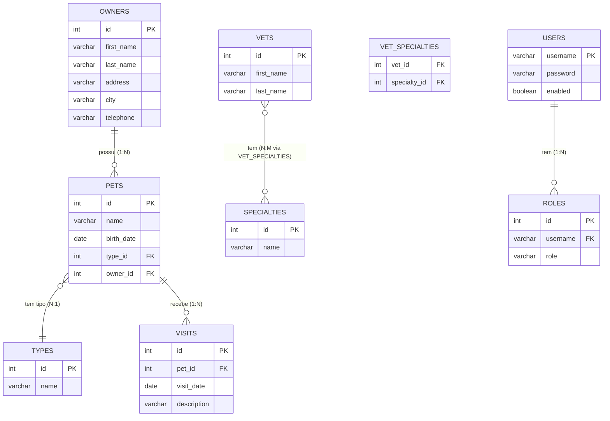
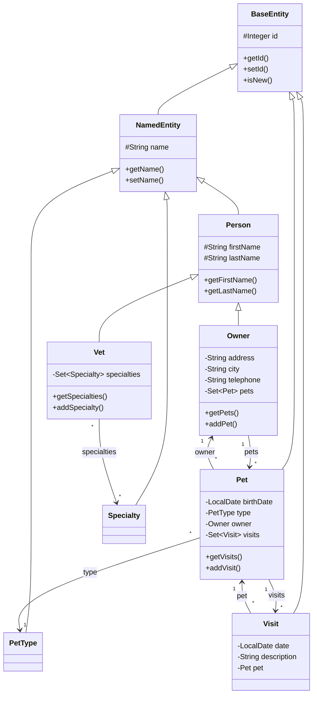
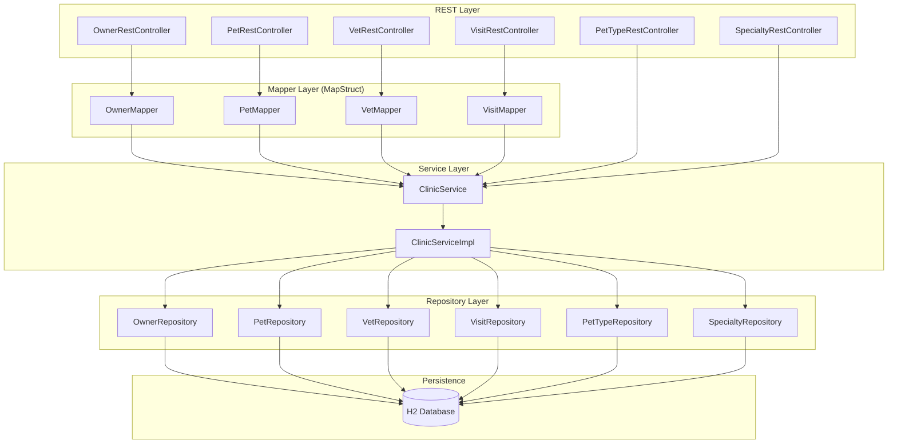
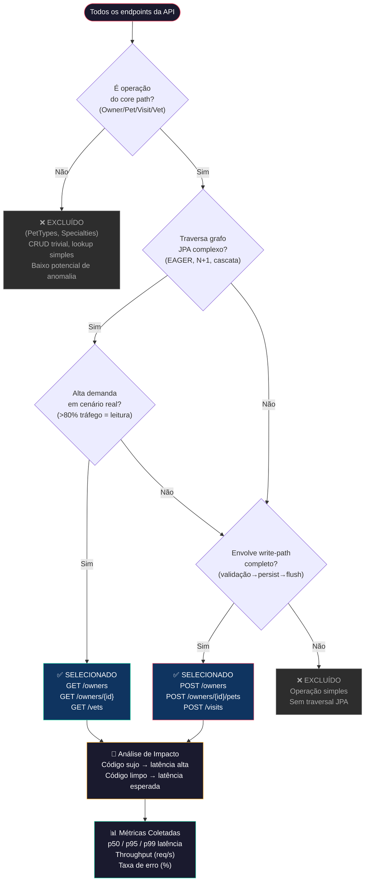
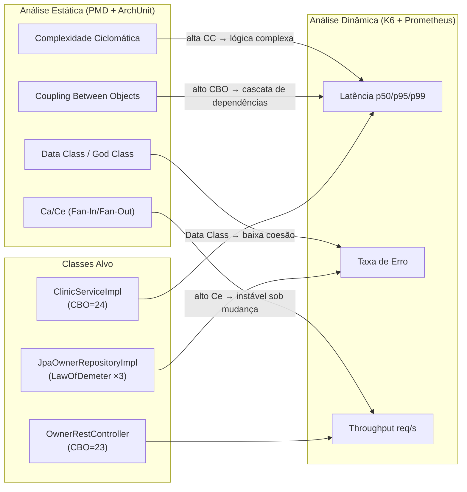

# Referência Técnica — Spring PetClinic REST (TCC)

## Visão Geral

O **Spring PetClinic REST** é uma aplicação de referência que expõe uma API REST completa para gerenciamento de uma clínica veterinária. Neste TCC, o projeto serve como **objeto de estudo** para análise de métricas de refatoração: é analisado estaticamente (PMD, ArchUnit) e dinamicamente (K6, Prometheus, Grafana) antes e depois de refatorações.

| Atributo | Valor |
|---|---|
| **Framework** | Spring Boot 4.0.6 |
| **Java** | 21 |
| **Banco** | H2 (in-memory, perfil padrão) |
| **API** | OpenAPI 3.0 (contrato-first) |
| **Porta** | 9966 |
| **Context-path** | `/petclinic/` |
| **Segurança** | Desabilitada para dev (`petclinic.security.enable=false`) |

---

## Árvore de Arquivos

```
spring-petclinic-rest/
├── pom.xml                          # Dependências e plugins Maven
├── ruleset.xml                      # Ruleset PMD 7.x (ISO 25010)
├── src/
│   ├── main/
│   │   ├── java/.../petclinic/
│   │   │   ├── model/               # Entidades JPA (domínio)
│   │   │   │   ├── BaseEntity.java       # @Id + @GeneratedValue
│   │   │   │   ├── NamedEntity.java      # + name
│   │   │   │   ├── Person.java           # + firstName, lastName
│   │   │   │   ├── Owner.java            # + address, city, telephone, pets
│   │   │   │   ├── Pet.java              # + birthDate, type, owner, visits
│   │   │   │   ├── PetType.java          # tipo do pet (cat, dog, etc.)
│   │   │   │   ├── Visit.java            # + date, description, pet
│   │   │   │   ├── Vet.java              # + specialties (N:M)
│   │   │   │   ├── Specialty.java        # especialidade veterinária
│   │   │   │   ├── User.java             # autenticação
│   │   │   │   └── Role.java             # papéis de acesso
│   │   │   ├── repository/          # Interfaces de repositório
│   │   │   │   ├── jpa/                  # Implementação JPA pura
│   │   │   │   ├── jdbc/                 # Implementação JDBC
│   │   │   │   └── springdatajpa/        # Implementação Spring Data JPA
│   │   │   ├── service/             # Camada de serviço (facade)
│   │   │   │   ├── ClinicService.java        # Interface
│   │   │   │   └── ClinicServiceImpl.java    # Implementação (@Transactional)
│   │   │   ├── rest/
│   │   │   │   ├── controller/       # REST Controllers
│   │   │   │   │   ├── OwnerRestController.java
│   │   │   │   │   ├── PetRestController.java
│   │   │   │   │   ├── VetRestController.java
│   │   │   │   │   ├── VisitRestController.java
│   │   │   │   │   ├── PetTypeRestController.java
│   │   │   │   │   ├── SpecialtyRestController.java
│   │   │   │   │   └── UserRestController.java
│   │   │   │   ├── advice/           # @ControllerAdvice global
│   │   │   │   └── validation/       # Validadores customizados
│   │   │   ├── mapper/              # MapStruct (Entity ↔ DTO)
│   │   │   ├── security/            # Configuração Spring Security
│   │   │   └── util/
│   │   │       └── CallMonitoringAspect.java  # AOP: monitoramento JMX
│   │   └── resources/
│   │       ├── application.properties        # Configuração principal
│   │       ├── openapi.yml                   # Contrato OpenAPI 3.0
│   │       └── db/h2/schema.sql + data.sql   # DDL + seed data
│   └── test/
│       ├── java/.../petclinic/
│       │   ├── architecture/          # Testes ArchUnit (ISO 25010)
│       │   │   └── ValidacaoArquiteturalTest.java
│       │   ├── rest/controller/      # Testes dos controllers (MockMvc)
│       │   ├── service/clinicService/ # Testes do service (vários backends)
│       │   ├── service/userService/   # Testes do UserService
│       │   └── model/                # Testes de validação
│       ├── jmeter/                   # Benchmark JMeter (referência)
│       └── postman/                  # Coleção Postman para regressão
├── docs/
│   └── analise-estatica-iso25010.md  # Documentação detalhada PMD + ArchUnit
```

---

## Modelo de Domínio (Diagrama ER)



---

## Hierarquia de Classes (Herança JPA)



---

## Arquitetura em Camadas



---

## Endpoints da API REST

Base URL: `http://localhost:9966/petclinic/api`

### Owners (Donos)

| Método | Endpoint | Descrição |
|---|---|---|
| `GET` | `/owners` | Listar todos os donos |
| `GET` | `/owners?lastName={name}` | Buscar por sobrenome |
| `GET` | `/owners/{ownerId}` | Obter dono por ID |
| `POST` | `/owners` | Criar novo dono |
| `PUT` | `/owners/{ownerId}` | Atualizar dono |
| `DELETE` | `/owners/{ownerId}` | Remover dono |
| `GET` | `/v2/owners` | Listar donos (paginado) |

### Pets

| Método | Endpoint | Descrição |
|---|---|---|
| `GET` | `/pets` | Listar todos os pets |
| `GET` | `/pets/{petId}` | Obter pet por ID |
| `POST` | `/owners/{ownerId}/pets` | Adicionar pet a um dono |
| `PUT` | `/owners/{ownerId}/pets/{petId}` | Atualizar pet |
| `DELETE` | `/pets/{petId}` | Remover pet |

### Visits (Visitas)

| Método | Endpoint | Descrição |
|---|---|---|
| `GET` | `/visits` | Listar todas as visitas |
| `GET` | `/visits/{visitId}` | Obter visita por ID |
| `POST` | `/owners/{ownerId}/pets/{petId}/visits` | Adicionar visita |
| `PUT` | `/visits/{visitId}` | Atualizar visita |
| `DELETE` | `/visits/{visitId}` | Remover visita |

### Vets (Veterinários)

| Método | Endpoint | Descrição |
|---|---|---|
| `GET` | `/vets` | Listar todos os veterinários |
| `GET` | `/vets/{vetId}` | Obter vet por ID |
| `POST` | `/vets` | Criar veterinário |
| `PUT` | `/vets/{vetId}` | Atualizar veterinário |
| `DELETE` | `/vets/{vetId}` | Remover veterinário |

### PetTypes e Specialties

| Método | Endpoint | Descrição |
|---|---|---|
| `GET` | `/pettypes` | Listar tipos de pet |
| `GET` | `/specialties` | Listar especialidades |

### Observabilidade

| Endpoint | Descrição |
|---|---|
| `/actuator/health` | Status da aplicação |
| `/actuator/prometheus` | Métricas Micrometer (formato Prometheus) |
| `/actuator/metrics` | Métricas Spring Boot |
| `/actuator/info` | Informações do build |
| `/swagger-ui.html` | Swagger UI interativo |

---

## Endpoints Críticos para Análise Dinâmica

Os endpoints abaixo foram selecionados para o teste de carga K6 por representarem as operações mais relevantes para a análise de correlação estática ↔ dinâmica.

### Critérios de Seleção

A escolha dos endpoints para teste de carga segue dois critérios fundamentais:

1. **Criticidade para o negócio**: São endpoints que, em um cenário real de produção, seriam os mais acessados por usuários e integrações. A degradação destes impacta diretamente a percepção de qualidade dos stakeholders que dependem do sistema.
2. **Sensibilidade ao débito técnico**: São endpoints cuja implementação atravessa camadas com alta complexidade (CC, CBO) — portanto, candidatos naturais para evidenciar diferença de desempenho entre código "sujo" (baseline) e código "limpo" (pós-refatoração).

### Fluxo de Decisão: Por que estes endpoints?



### Mapeamento Endpoint → Risco → Impacto

| Endpoint | Por que é crítico? | Risco sob estresse | Impacto no usuário real |
|---|---|---|---|
| `GET /owners` | **Carga N+1**: `Owner` carrega `Set<Pet>` com `FetchType.EAGER`, que por sua vez carrega `Set<Visit>` EAGER. Listar todos os owners executa cascata de queries | Latência cresce com volume de dados | Lentidão na tela principal de busca — primeiro contato do recepcionista |
| `POST /owners` | **Write-path completo**: validação → mapeamento → JPA persist → flush. Transação completa | Contenção de locks no banco | Falha no cadastro de novos clientes — perda de receita |
| `GET /owners/{id}` | **Consulta com grafo**: retorna owner + pets + visits aninhados. Potencial N+1 se não otimizado | Latência proporcional ao nº de pets/visits | Atraso ao abrir ficha do paciente durante consulta |
| `POST /owners/{id}/pets` | **Cascata JPA**: `CascadeType.ALL` no `Pet.type` pode causar side-effects inesperados. `savePet()` faz lookup de `PetType` antes de salvar | Falha silenciosa se type_id inválido | Erro ao registrar novo animal — processo manual de fallback |
| `POST /visits` | **Inserção em tabela filha**: criação de visit requer lookup do pet, potencial lock no owner pai via foreign key | Deadlock sob alta concorrência | Perda de registro de consulta — risco clínico (histórico incompleto) |
| `GET /vets` | **Relação N:M**: `Vet` → `Specialty` via `@ManyToMany EAGER` + tabela de junção `vet_specialties`. Grafo de objetos denso | Memory pressure com muitos vets | Lentidão na agenda de veterinários — atrasos no atendimento |

### Trade-off: Por que esses e não outros?

| Decisão | Rationale |
|---|---|
| **Foco em Owner/Pet/Visit** | São o "core path" da aplicação — onde a complexidade de negócio e JPA se concentra |
| **Inclusão de Vets** | Exemplifica relação N:M (mais custosa que 1:N) — bom candidato para anomalias de acoplamento |
| **Exclusão de PetTypes/Specialties isolados** | São tabelas de lookup simples (CRUD trivial) — baixo potencial de anomalia estática ou dinâmica |
| **GET prioritário sobre DELETE** | Operações de leitura representam >80% do tráfego real e são onde `FetchType.EAGER` gera mais impacto |
| **Health check incluído** | Estabelece baseline de latência do framework puro (sem lógica de negócio) para normalização |

### Relação com Análise Estática



A hipótese do TCC é que classes com **alta complexidade ciclomática** e **alto acoplamento (CBO)** detectados pelo PMD tendem a apresentar **maior latência** e **maior taxa de erro** sob estresse, e que a refatoração dessas classes pode melhorar tanto as métricas estáticas quanto as dinâmicas.

---

## Infraestrutura de Análise Estática (ISO 25010)

> Para documentação técnica detalhada, consulte [analise-estatica-iso25010.md](analise-estatica-iso25010.md).

### Ferramentas

| Ferramenta | Versão | Escopo | Saída |
|---|---|---|---|
| **PMD** (via maven-pmd-plugin) | 7.7.0 (plugin 3.26.0) | Microestrutural: code smells, CC, CBO, LOC | `target/site/pmd.csv` |
| **ArchUnit** (archunit-junit5) | 1.3.0 | Macro-arquitetural: camadas, ciclos, métricas Ca/Ce | Console (Surefire) |

### Comandos Rápidos

```bash
# PMD → CSV + visualização no terminal
./mvnw compile pmd:pmd
./mvnw pmd:check -Dpmd.logViolationsToConsole=true

# ArchUnit → validação + métricas de acoplamento
./mvnw test -Dtest="ValidacaoArquiteturalTest" -Dsurefire.useFile=false
```

### Baseline de Violações PMD (Pré-Refatoração)

| Regra | Ocorrências | Classes Afetadas |
|---|---|---|
| DataClass | 7 | Person, Pet, Role, User, Visit, JdbcPet, BindingError |
| LawOfDemeter | 3 | JpaOwnerRepositoryImpl |
| CouplingBetweenObjects | 2 | OwnerRestController (CBO=23), ClinicServiceImpl (CBO=24) |
| **Total** | **12** | |

---

## Como Executar

### Compilar

```bash
mvn clean compile
```

### Executar Testes

```bash
mvn test                    # Roda todos os testes
mvn verify                  # Testes + JaCoCo coverage check
```

> **Importante para o TCC:** Os testes são o **contrato de comportamento** da aplicação. Refatorações devem **preservar todos os testes passando** — se um teste quebrar, a refatoração alterou comportamento observável e é inválida.

#### Testes disponíveis

| Categoria | Classes | O que testam |
|---|---|---|
| Controller (MockMvc) | `OwnerRestControllerTests`, `PetRestControllerTests`, `VetRestControllerTests`, `VisitRestControllerTests`, `PetTypeRestControllerTests`, `SpecialtyRestControllerTests`, `UserRestControllerTests` | Endpoints REST, serialização JSON, HTTP status codes |
| Service | `ClinicServiceJpaTests`, `ClinicServiceSpringDataJpaTests`, `ClinicServiceH2JdbcTests`, `ClinicServiceHsqlJdbcTests` | Lógica de negócio nos diferentes backends de persistência |
| Validação | `ValidatorTests`, `PetAgeValidatorTest` | Constraints de Bean Validation |
| Arquitetural (ArchUnit) | `ValidacaoArquiteturalTest` | Isolamento de camadas, ausência de ciclos, métricas Ca/Ce por pacote |
| Config | `SpringConfigTests` | Context carrega sem erros |

### Rodar a aplicação

```bash
mvn spring-boot:run
```

Acesse:
- **API**: http://localhost:9966/petclinic/api/owners
- **Swagger UI**: http://localhost:9966/petclinic/swagger-ui.html
- **Prometheus**: http://localhost:9966/petclinic/actuator/prometheus

---

## Dependências do pom.xml (Resumo)

### Aplicação

| Dependência | Propósito |
|---|---|
| `spring-boot-starter-webmvc` | REST API |
| `spring-boot-starter-data-jpa` | Persistência JPA |
| `spring-boot-starter-actuator` | Endpoints de gerenciamento |
| `spring-boot-starter-aspectj` | AOP (`@Observed`, `CallMonitoringAspect`) |
| `spring-boot-starter-security` | Autenticação/autorização |
| `spring-boot-starter-validation` | Bean Validation (Jakarta) |
| `spring-boot-starter-cache` | Cache de queries |
| `micrometer-registry-prometheus` | Exportação de métricas para Prometheus |
| `springdoc-openapi-starter-webmvc-ui` | Swagger UI + OpenAPI |
| `mapstruct` | Mapeamento Entity ↔ DTO |
| `com.vmware.sdk:pbm` | Análise de código complementar |

### Bancos de dados (perfis)

| Perfil | Banco |
|---|---|
| `h2` (padrão) | H2 in-memory |
| `hsqldb` | HSQLDB in-memory |
| `mysql` | MySQL |
| `postgres` | PostgreSQL |

### Plugins de qualidade

| Plugin | Propósito |
|---|---|
| `jacoco-maven-plugin` | Cobertura de código (85% line, 66% branch) |
| `maven-pmd-plugin` | Análise estática PMD 7.x (code smells, CC, CBO) |
| `archunit-junit5` | Validação arquitetural (camadas, ciclos, métricas Ca/Ce) |
| `spotbugs-maven-plugin` | Detecção de bugs |
| `refactor-first-maven-plugin` | Priorização de refatoração |
| `openapi-generator-maven-plugin` | Geração de DTOs e interfaces a partir do contrato |
