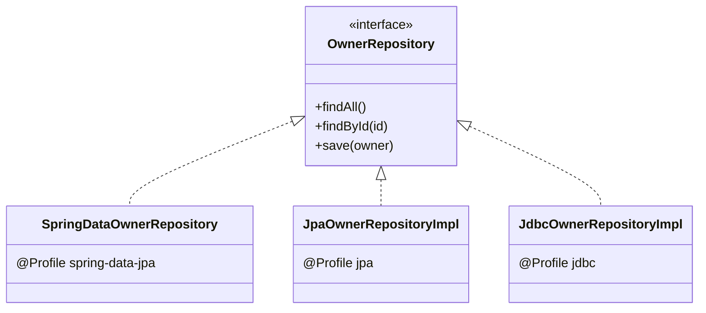
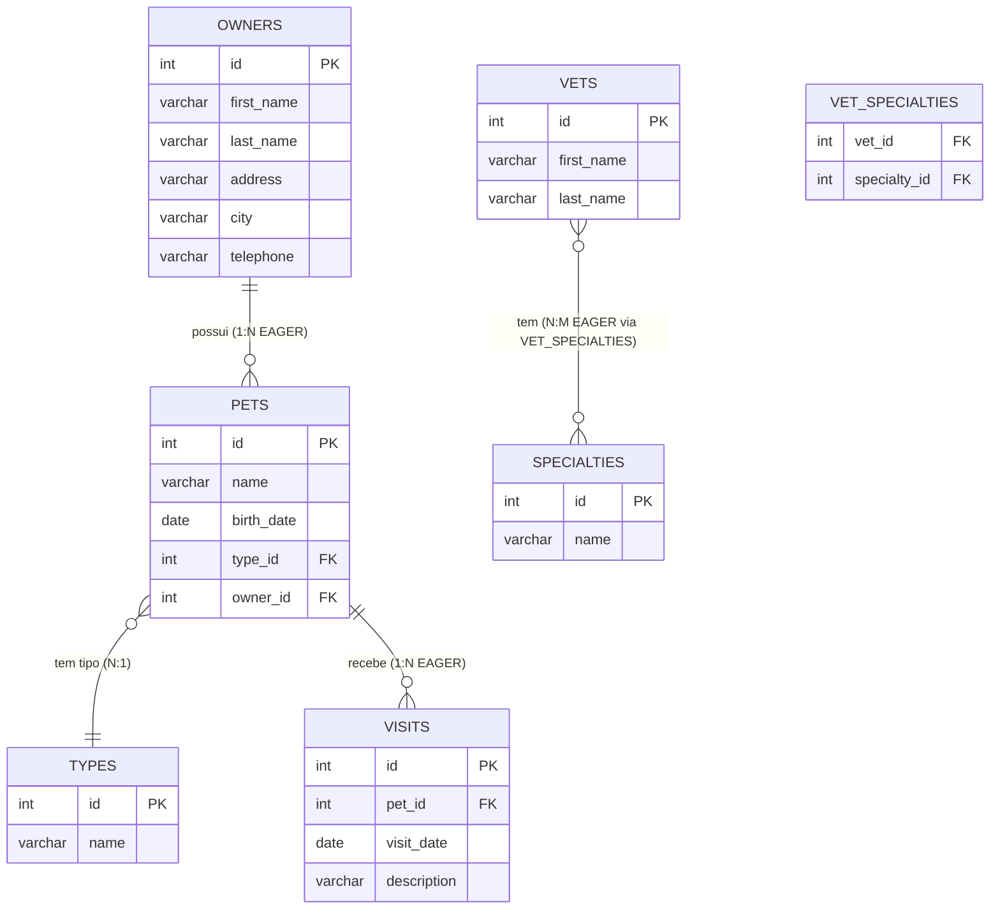
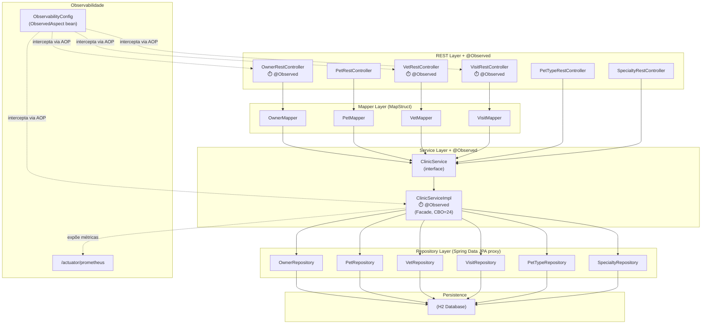
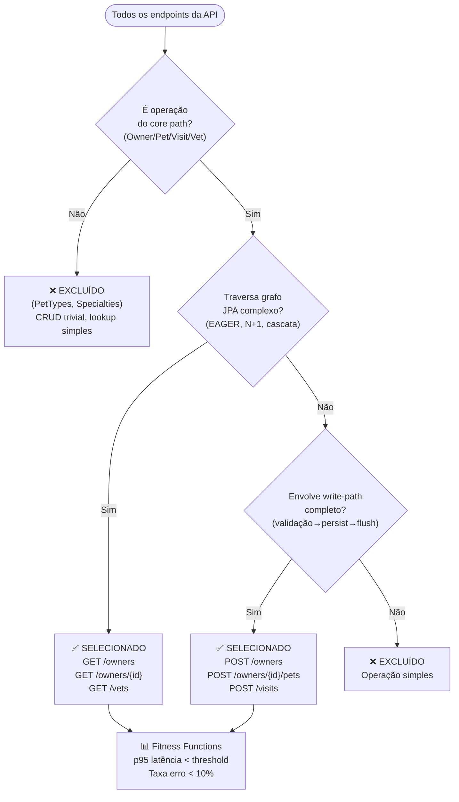
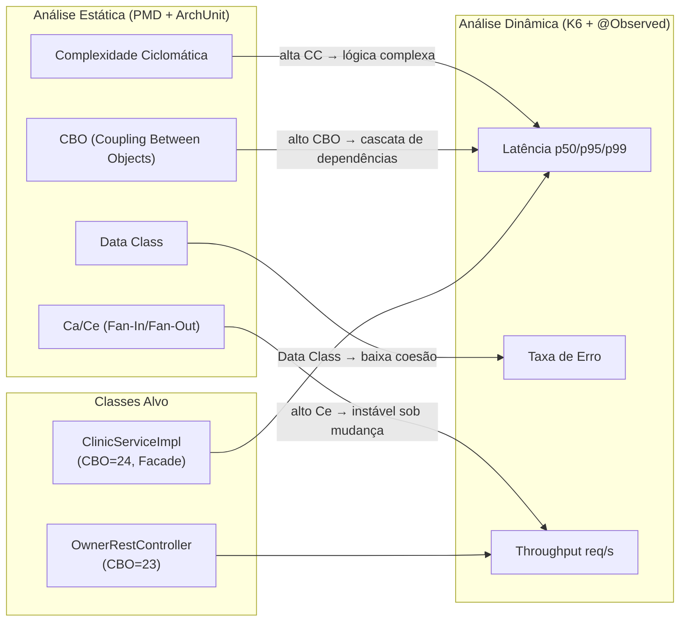
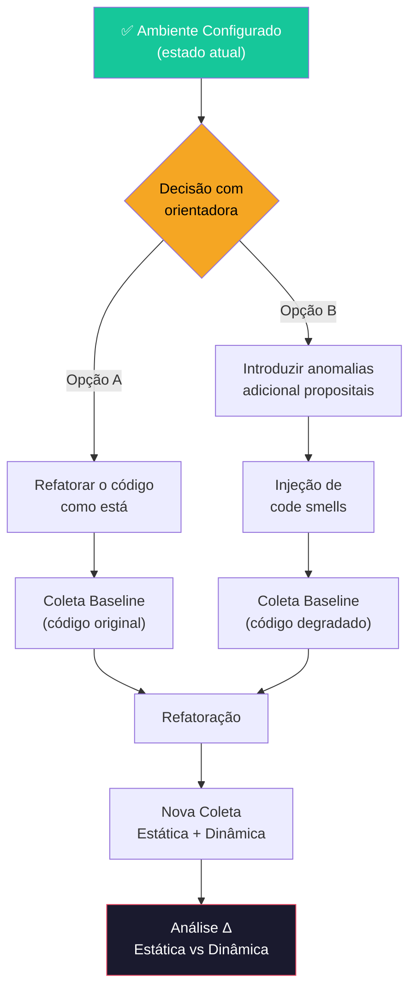

# Referência Técnica — Spring PetClinic REST (TCC)

## Contexto Acadêmico

Este repositório é um **fork** do [spring-petclinic-rest](https://github.com/spring-petclinic/spring-petclinic-rest) (commit `4020fdb`), adaptado como objeto de estudo para um Trabalho de Conclusão de Curso (TCC) no IFBA. O código de negócio permanece **idêntico ao do projeto original** — todas as modificações realizadas são exclusivamente de **instrumentação, análise e documentação**, preservando o comportamento funcional verificável pelos testes unitários existentes.

O TCC investiga a hipótese de que **débito técnico estrutural** (code smells detectáveis por análise estática) produz **degradação mensurável no comportamento dinâmico** (latência, throughput, taxa de erro) sob teste de carga.

A configuração do ambiente experimental está concluída. O código original do fork já apresenta características estruturais de interesse para a pesquisa (uso de `FetchType.EAGER`, Facade com CBO elevado, relações N:M). A estratégia experimental — se o estudo partirá do código tal como está ou se serão introduzidas anomalias adicionais — definida em conjunto com a orientadora.

> **Fundamentação:** Richards e Ford (2020) argumentam que "toda decisão arquitetural é um trade-off" e que fitness functions automatizadas são a forma objetiva de validar se um trade-off foi benéfico. Os thresholds do K6 (`p95 < 5000ms`) e as regras PMD (CBO ≤ 20) funcionam como fitness functions complementares: a primeira protege a Performance Efficiency (ISO 25010), a segunda protege a Maintainability.

### Relação entre Sub-Projetos

O projeto de TCC é composto por **dois repositórios independentes**, sob mesma orientação acadêmica:

| Repositório | Escopo | Conteúdo |
|---|---|---|
| **spring-petclinic-rest** | Aplicação sob teste | Código Java, análise estática, instrumentação `@Observed`, documentação técnica |
| **infra** | Stack de observabilidade | Docker Compose, Prometheus, Grafana, K6, dashboards provisionados |

Ambos residem no workspace `refactoring-metrics/` e são versionados separadamente para manter rastreabilidade do fork upstream.

---

## Modificações sobre o Projeto Original

Todos os arquivos abaixo foram **criados ou modificados** desde o fork. O código de negócio original (controllers, services, repositories, models) permanece funcional e coberto pelos testes do upstream.

### Instrumentação e Observabilidade

| Arquivo | Ação | Finalidade |
|---|---|---|
| `config/ObservabilityConfig.java` | **Criado** | Registra `ObservedAspect` para processar `@Observed` via AOP |
| `OwnerRestController.java` | **Modificado** | `@Observed` em 5 métodos críticos (listOwners, getOwner, addOwner, addPetToOwner, addVisitToOwner) |
| `VetRestController.java` | **Modificado** | `@Observed` em `listVets` |
| `VisitRestController.java` | **Modificado** | `@Observed` em `addVisit` |
| `ClinicServiceImpl.java` | **Modificado** | `@Observed` em 7 métodos de serviço (findAll, findById, save por entidade) |
| `application.properties` | **Modificado** | Exposição de endpoints Actuator (prometheus, health, metrics, info) |

### Análise Estática

| Arquivo | Ação | Finalidade |
|---|---|---|
| `ruleset.xml` | **Criado** | Ruleset PMD 7.x com 8 regras mapeadas para ISO 25010 |
| `ValidacaoArquiteturalTest.java` | **Criado** | Testes ArchUnit: isolamento de camadas, ciclos, métricas Ca/Ce |
| `pom.xml` | **Modificado** | Plugins PMD, ArchUnit, JaCoCo, SpotBugs, RefactorFirst |

### Documentação

| Arquivo | Ação | Finalidade |
|---|---|---|
| `docs/referencia-tecnica-petclinic.md` | **Criado** | Este documento |
| `docs/analise-estatica-iso25010.md` | **Criado** | Documentação PMD + ArchUnit com mapeamento ISO 25010 |
| `docs/instrumentacao-dinamica-observability.md` | **Criado** | Mapeamento de `@Observed` por fluxo com fundamentação teórica |

> **Princípio:** Fowler (2018) define refatoração como "melhoria da estrutura interna sem alterar o comportamento observável". Aplicamos o mesmo princípio à instrumentação: nenhuma anotação `@Observed` altera o fluxo funcional — são cross-cutting concerns transparentes via AOP (Gamma et al., 1995: padrão Observer aplicado via proxy).

---

## Visão Geral da Aplicação

| Atributo | Valor |
|---|---|
| **Framework** | Spring Boot 4.0.6 |
| **Java** | 21 |
| **Banco** | H2 (in-memory, perfil padrão) |
| **API** | OpenAPI 3.0 (contrato-first) |
| **Porta** | 9966 |
| **Context-path** | `/petclinic/` |
| **Segurança** | Desabilitada para dev (`petclinic.security.enable=false`) |

### Árvore de Arquivos

Arquivos marcados com `★` foram **criados pelo TCC**. Arquivos marcados com `✎` foram **modificados pelo TCC**.

```
spring-petclinic-rest/
├── pom.xml                          ✎ Plugins PMD, ArchUnit, JaCoCo, Micrometer
├── ruleset.xml                      ★ Ruleset PMD 7.x (8 regras → ISO 25010)
├── docs/
│   ├── referencia-tecnica-petclinic.md       ★ Este documento
│   ├── analise-estatica-iso25010.md          ★ Documentação PMD + ArchUnit
│   └── instrumentacao-dinamica-observability.md ★ Mapeamento @Observed
├── src/main/java/.../petclinic/
│   ├── config/
│   │   ├── ObservabilityConfig.java          ★ Bean ObservedAspect (AOP)
│   │   └── SwaggerConfig.java
│   ├── model/
│   │   ├── BaseEntity.java
│   │   ├── NamedEntity.java
│   │   ├── Person.java
│   │   ├── Owner.java
│   │   ├── Pet.java
│   │   ├── PetType.java
│   │   ├── Visit.java
│   │   ├── Vet.java
│   │   ├── Specialty.java
│   │   ├── User.java
│   │   └── Role.java
│   ├── service/
│   │   ├── ClinicService.java               (interface)
│   │   ├── ClinicServiceImpl.java           ✎ @Observed em 7 métodos
│   │   ├── UserService.java
│   │   └── UserServiceImpl.java
│   ├── rest/controller/
│   │   ├── OwnerRestController.java         ✎ @Observed em 5 métodos
│   │   ├── VetRestController.java           ✎ @Observed em listVets
│   │   ├── VisitRestController.java         ✎ @Observed em addVisit
│   │   ├── PetRestController.java
│   │   ├── PetTypeRestController.java
│   │   ├── SpecialtyRestController.java
│   │   └── UserRestController.java
│   ├── mapper/                              MapStruct (Entity ↔ DTO)
│   ├── repository/
│   │   ├── springdatajpa/                   Implementação ativa (perfil padrão)
│   │   ├── jpa/                             Implementação JPA pura
│   │   └── jdbc/                            Implementação JDBC
│   ├── security/
│   └── util/
│       └── CallMonitoringAspect.java        AOP: monitoramento JMX (original)
├── src/main/resources/
│   ├── application.properties               ✎ Endpoints Actuator expostos
│   ├── openapi.yml                          Contrato OpenAPI 3.0
│   └── db/h2/schema.sql + data.sql          DDL + seed data
├── src/test/java/.../petclinic/
│   ├── architecture/
│   │   └── ValidacaoArquiteturalTest.java   ★ Testes ArchUnit
│   ├── rest/controller/                     Testes MockMvc (original)
│   ├── service/                             Testes de serviço (original)
│   └── model/                               Testes de validação (original)
├── src/test/jmeter/                         Benchmark JMeter (original)
└── src/test/postman/                        Coleção Postman (original)
```

---

## Padrões de Projeto Identificados

O PetClinic REST emprega padrões clássicos do catálogo GoF (Gamma et al., 1995) e padrões arquiteturais que são diretamente relevantes para a análise de débito técnico:

### Facade — `ClinicServiceImpl`

O `ClinicServiceImpl` implementa o padrão **Facade** (GoF): fornece uma interface unificada para o subsistema de repositórios (6 dependências injetadas). Toda operação de negócio passa por este ponto único, o que:

- **Benefício:** simplifica o acesso para os controllers (um único `ClinicService` em vez de 6 repositórios)
- **Custo:** concentra acoplamento (CBO=24, acima do limiar de 20) — exatamente o tipo de trade-off que Richards e Ford (2020) descrevem como "decisão que otimiza uma característica às custas de outra"

> Elemar Jr. observa que "um Facade com CBO alto é um sintoma de que o subsistema por trás dele cresceu além do escopo original". A refatoração natural seria extrair serviços de domínio (`OwnerService`, `VetService`), reduzindo o CBO por classe mas aumentando o número de beans no contexto Spring.

### Strategy — Perfis de Persistência

O sistema de perfis Spring (`h2`, `hsqldb`, `mysql`, `postgres`) combinado com as interfaces de repositório (`OwnerRepository`, `VetRepository`) implementa o padrão **Strategy**: a mesma interface é servida por implementações diferentes (`SpringDataOwnerRepository`, `JpaOwnerRepositoryImpl`, `JdbcOwnerRepositoryImpl`) selecionadas em tempo de configuração.



> Para o TCC, usamos exclusivamente o perfil `spring-data-jpa` com H2, garantindo consistência entre execuções experimentais.

---

## Modelo de Domínio (Diagrama ER)



> **Observação sobre o código original:** As relações `Owner→Pet` e `Pet→Visit` usam `FetchType.EAGER` como definido pelo projeto upstream. Isso significa que carregar um único Owner dispara queries em cascata para todas as entidades associadas. Fowler (2018) classifica esse padrão como "inappropriate intimacy". Essa característica herdada do fork é um dos pontos de interesse para análise de performance no TCC.

---

## Arquitetura em Camadas com Instrumentação



---

## Endpoints Críticos para Análise Dinâmica

Os endpoints abaixo foram selecionados para o teste de carga K6 por representarem as operações mais relevantes para a análise de correlação estática ↔ dinâmica.

### Critérios de Seleção

A escolha segue dois critérios fundamentais, alinhados com a definição de fitness functions de Ford, Parsons e Kua (2017):

1. **Sensibilidade ao débito técnico:** endpoints cuja implementação traversa camadas com alta complexidade (CC, CBO) — candidatos naturais para evidenciar diferença de performance entre código "sujo" (baseline) e "limpo" (pós-refatoração).
2. **Representatividade operacional:** endpoints que, em cenário real, concentrariam >80% do tráfego (leituras dominam escritas em APIs REST).

### Fluxo de Decisão



### Mapeamento Endpoint → Característica Estrutural → Instrumentação

| Endpoint | Característica Estrutural (herdada do fork) | Risco sob Estresse | Instrumentação @Observed |
|---|---|---|---|
| `GET /owners` | N+1: `Owner` → `Set<Pet>` EAGER → `Set<Visit>` EAGER | Latência cresce com volume | Controller + Service |
| `GET /owners/{id}` | Grafo denso: owner + pets + visits aninhados | Proporcional ao nº de pets/visits | Controller + Service |
| `POST /owners` | Write-path: validação → MapStruct → JPA persist → flush | Contenção de locks | Controller + Service |
| `POST /owners/{id}/pets` | Cascata JPA: `savePet()` faz lookup de `PetType` + persist | Side-effects com `CascadeType.ALL` | Controller + 3 métodos Service |
| `POST /visits` | Inserção em tabela filha com FK para pet | Deadlock sob concorrência | Controller + Service |
| `GET /vets` | N:M EAGER: `Vet` → `Specialty` via tabela de junção | Memory pressure | Controller + Service |

### Correlação Estática ↔ Dinâmica



> **Hipótese do TCC:** Classes com alta CC e alto CBO, detectados pelo PMD, tendem a apresentar maior latência e maior taxa de erro sob estresse. A refatoração dessas classes melhora ambas as dimensões — validável pela comparação dos deltas entre Fase 1 e Fase 2.

---

## Endpoints da API REST

Base URL: `http://localhost:9966/petclinic/api`

### Owners

| Método | Endpoint | Descrição |
|---|---|---|
| `GET` | `/owners` | Listar todos os donos |
| `GET` | `/owners?lastName={name}` | Buscar por sobrenome |
| `GET` | `/owners/{ownerId}` | Obter dono por ID |
| `POST` | `/owners` | Criar novo dono |
| `PUT` | `/owners/{ownerId}` | Atualizar dono |
| `DELETE` | `/owners/{ownerId}` | Remover dono |

### Pets

| Método | Endpoint | Descrição |
|---|---|---|
| `GET` | `/pets` | Listar todos os pets |
| `GET` | `/pets/{petId}` | Obter pet por ID |
| `POST` | `/owners/{ownerId}/pets` | Adicionar pet a um dono |
| `PUT` | `/owners/{ownerId}/pets/{petId}` | Atualizar pet |
| `DELETE` | `/pets/{petId}` | Remover pet |

### Visits

| Método | Endpoint | Descrição |
|---|---|---|
| `GET` | `/visits` | Listar todas as visitas |
| `GET` | `/visits/{visitId}` | Obter visita por ID |
| `POST` | `/owners/{ownerId}/pets/{petId}/visits` | Adicionar visita |
| `POST` | `/visits` | Criar visita (direto) |
| `PUT` | `/visits/{visitId}` | Atualizar visita |
| `DELETE` | `/visits/{visitId}` | Remover visita |

### Vets

| Método | Endpoint | Descrição |
|---|---|---|
| `GET` | `/vets` | Listar todos os veterinários |
| `GET` | `/vets/{vetId}` | Obter vet por ID |
| `POST` | `/vets` | Criar veterinário |
| `PUT` | `/vets/{vetId}` | Atualizar veterinário |
| `DELETE` | `/vets/{vetId}` | Remover veterinário |

### Observabilidade

| Endpoint | Descrição |
|---|---|
| `/actuator/health` | Status da aplicação |
| `/actuator/prometheus` | Métricas Micrometer (formato Prometheus) |
| `/actuator/metrics` | Métricas Spring Boot |
| `/swagger-ui.html` | Swagger UI interativo |

---

## Infraestrutura de Análise Estática

> Documentação completa: [analise-estatica-iso25010.md](analise-estatica-iso25010.md)

### Baseline de Violações PMD (Pré-Refatoração)

| Regra | Ocorrências | Classes Afetadas |
|---|---|---|
| DataClass | 7 | Person, Pet, Role, User, Visit, JdbcPet, BindingError |
| LawOfDemeter | 3 | JpaOwnerRepositoryImpl |
| CouplingBetweenObjects | 2 | OwnerRestController (CBO=23), ClinicServiceImpl (CBO=24) |
| **Total** | **12** | |

---

## Instrumentação Dinâmica

> Documentação completa: [instrumentacao-dinamica-observability.md](instrumentacao-dinamica-observability.md)

A instrumentação usa `@Observed` do Micrometer em **duas camadas** (Controller + Service), gerando a métrica `metodo_execucao_seconds_bucket` agrupada por `spring_observation_contextual_name`. O delta `T(Controller) - T(Service)` isola o overhead de MapStruct + serialização JSON.

---

## Como Executar

### Compilar e Testar

```bash
mvn clean compile           # Compilação
mvn test                    # Todos os testes (unitários + ArchUnit)
mvn verify                  # Testes + JaCoCo coverage check
```

> **Contrato de comportamento:** os testes são a garantia de que refatorações não alteraram o comportamento observável. Se um teste quebrar após refatoração, a mudança é inválida (Fowler, 2018).

### Rodar a Aplicação

```bash
mvn spring-boot:run -DskipTests
```

- **API**: http://localhost:9966/petclinic/api/owners
- **Swagger UI**: http://localhost:9966/petclinic/swagger-ui.html
- **Prometheus**: http://localhost:9966/petclinic/actuator/prometheus

### Análise Estática

```bash
./mvnw clean compile pmd:pmd                                          # PMD → CSV
./mvnw pmd:check -Dpmd.logViolationsToConsole=true                    # Violações no terminal
./mvnw test -Dtest="ValidacaoArquiteturalTest" -Dsurefire.useFile=false  # ArchUnit
```

---

## Próximos Passos

A configuração do ambiente experimental está **concluída**. A partir deste ponto, o trabalho avança para a fase de coleta de dados e experimentação. A estratégia experimental será definida em conjunto com a orientadora, podendo seguir um de dois caminhos:



**Independente da opção escolhida**, os passos de coleta são idênticos:

1. **Coleta Baseline:** executar K6 + capturar PMD/ArchUnit sobre o código de referência
2. **Intervenção:** aplicar refatorações (extrair classes, corrigir FetchType, reduzir CBO) ou introduzir anomalias
3. **Nova Coleta:** re-executar K6 + PMD/ArchUnit
4. **Correlação:** comparar deltas (ΔCC, ΔCBO) com deltas (Δp95, Δthroughput)

---

## Referências

- RICHARDS, M.; FORD, N. **Fundamentos da Arquitetura de Software.** O'Reilly, 2020.
- FORD, N.; RICHARDS, M.; SADALAGE, P.; DEHGHANI, Z. **Arquitetura de Software: As Partes Difíceis.** O'Reilly, 2021.
- FORD, N.; PARSONS, R.; KUA, P. **Building Evolutionary Architectures.** O'Reilly, 2017.
- FOWLER, M. **Refatoração.** 2ª ed. Addison-Wesley, 2018.
- GAMMA, E.; HELM, R.; JOHNSON, R.; VLISSIDES, J. **Padrões de Projetos.** Addison-Wesley, 1995.
- ELEMAR JR. **Manual do Arquiteto de Software.** Blog. Disponível em: https://elemarjr.com
